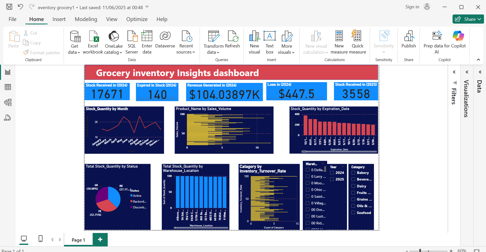

This Power BI dashboard transforms raw data into vital insights, enabling smarter business decisions.

Leveraging **DAX formulas**, I achieved clear visibility into a grocery business's past year, precisely quantifying:

* **Total Revenue Generated**
* **Loss from Expired Stock**
* **Key Inventory Movements**

This analysis provides essential solutions: empowering management to **reduce waste, optimize stock, and enhance profitability** by understanding exactly how the business performed and where improvements can be made.

*Caption: An overview of the Grocery Inventory Insights dashboard displaying key performance metrics and trends.*
